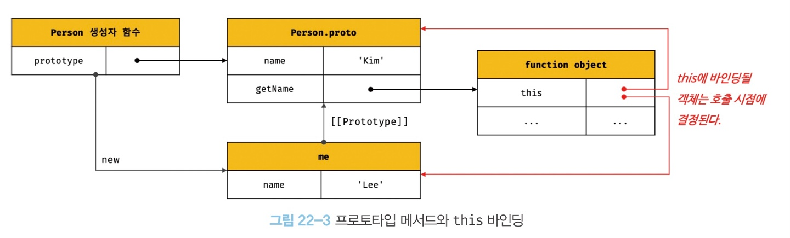
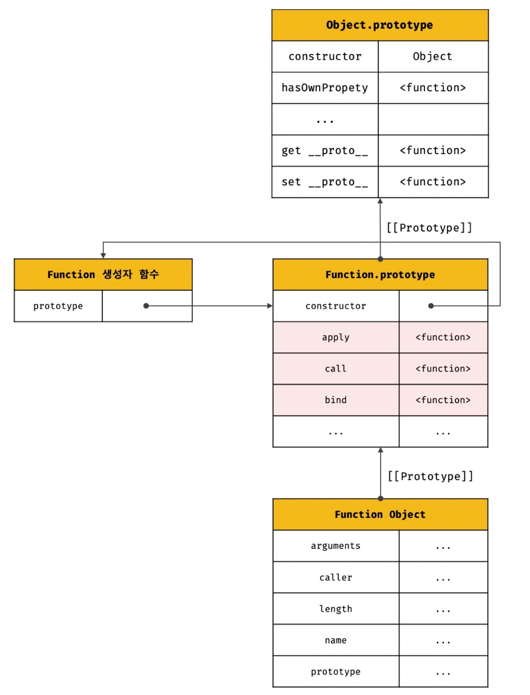

## 🗂️ 22장. this

### 목차
- [22.1 this 키워드](#22.1)
- [22.2 함수 호출 방식과 this 바인딩](#22.2)

<br />

### 22.1 this 키워드<a name="22.1"></a>
---

**💡 객체**: `상태(state)를 나타내는 프로퍼티`와 `동작(behavior)을 나타내는 메서드`를 하나의 논리적인 단위로 묶은 복합적인 자료구조

> 메서드가 자신이 속한 객체의 프로퍼티를 참조하려면, 자신이 속한 객체를 가리키는 식별자를 참조할 수 있어야 한다.

#### ✅ 생성자 함수 방식으로 인스턴스를 생성하는 경우
- 생성자 함수로 인스턴스를 생성하려면, 생성자 함수가 존재해야 함
- 생성자 함수를 정의하는 시점에는 아직 인스턴스 생성하기 전이므로 생성할 인스턴스를 가리키는 식별자를 알 수 없음
- 자신이 속한 객체 또는 자신이 생성할 인스턴스를 가리키는 특수한 식별자(**this**)필요

#### ✅ this
- 자신이 속한 객체 또는 자신이 생성할 인스턴스를 가리키는 자기 참조 변수
- this를 통해 자신이 속한 객체 또는 다신이 생성할 인스턴스의 프로퍼티나 메소드 참조 가능
- this가 가리키는 값, 즉 **this 바인딩은 함수 호출 방식에 의해 동적으로 결정**

**💡 this 바인딩**: this와 this가 가리킬 객체를 바인딩(식별자와 값을 연결하는 과정)하는 것

#### ✅ 객체 리터럴 방식 & 생성자 함수 방식의 this
~~자바나 C++ 같은 클래스 기반 언어네서의 this는 언제나 클래스가 생성하는 인스턴스~~

**그러나 자바스크립트의 this는 상황에 따라 가리키는 대상이 다름! 함수가 호출되는 방식에 따라 동적으로 결정**

1. 객체 리터럴 방식 -> 메서드 내부에서의 this는 호출한 객체, 즉 circle
```js
// 객체 리터럴
const circle = {
  radius: 5,
  getDiameter() {
    // this는 메서드를 호출한 객체를 가리킴
    return 2 * this.radius;
  }
};

console.log(circle.getDiameter()); // 10
```

2. 생성자 함수 -> this는 생성자 함수가 생성할 인스턴스
```js
// 생성자 함수
function Circle(radius) {
  // this는 생성자 함수가 생성할 인스턴스를 가리킴
  this.radius = radius;
}

Circle.prototype.getDiameter = function() {
  // this는 생성자 함수가 생성할 인스턴스를 가리킴
  return 2 * this.radius;
};

// 인스턴스 생성
const circle = new Circle(5);
console.log(circle.getDiameter()); // 10
```

### 22.2 함수 호출 방식과 this 바인딩<a name="22.2"></a>
---
**this 바인딩(this에 바인딩 될 값)은 함수 호출 방식, 즉 함수가 어떻게 호출되었는지에 따라 동적으로 결정**

**💡 렉시컬 스코프(lexical scope)**: 함수의 상위 스코프를 결정하는 방식
> 렉시컬 스코프는 함수 정의가 평가되어 **함수 객체가 생성되는 시점**에 상위 스코프를 결정

>  this 바인딩은 **함수 호출 시점**에 결정

#### ✅ 일반 함수 호출
- (전역 함수, 중첩 함수, 콜백 함수 등)어떠한 함수라도 일반 함수로 호출하면 함수 내부의 this에는 전역 객체가 바인딩
- 중첩 함수 또는 콜백 함수는 외부 함수를 돕는 헬퍼 함수의 역할
  - 외부 함수인 메서드와 중첩 함수 또는 콜백 함수의 this가 일치하지 않는다는 것은 헬퍼 함수로 동작하기 어렵게 만듬!

  #### 🔍 메서드 내부의 중첩 함수나 콜백 함수의 this 바인딩을 메서드의 this 바인딩과 일치시키기 위한 방법
  ```js
  var value = 1;

  const obj = {
    value: 100,
    foo() {
      // this 바인딩(obj)를 변수 that에 할당
      const that = this;

      // 콜백 함수 내부에서 this대신 that을 참조
      setTimeout(function() {
        console.log(that.value); // 100
      }, 100);
    }
  };

  obj.foo();
  ```

    ```js
  var value = 1;

  const obj = {
    value: 100,
    foo() {
      // 화살표 함수 내부의 this는 상위 스코프의 this를 가리킴
      setTimeout(() => console.log(this.value), 100); // 100
      }
  };

  obj.foo();
  ```

#### ✅ 메서드 호출
- 메서드 내부의 this에는 메서드를 호출한 객체, 즉 메서드를 호출할 때 메서드 이름 앞의 마침표(.) 연산자 앞에 기술한 객체가 바인딩
- 메서드 내부의 this는 메서드를 소유한 객체가 아닌 **메서드를 호출한 객체에 바인딩**
- 메서드는 객체에 포함된 것이 아니라 독립적으로 존재하는 별도의 객체!



```js
const person = {
  name: 'Lee',
  getName() {
    // 메서드 내부의 this는 메서드를 호출한 객체에 바인딩
    return this.name;
  }
}

const anotherPerson = {
  name: 'Kim'
};
// getName 메서드를 anotherPerson 객체의 메서드로 할당
anotherPerson.getName = person.getName;

// getName 메서드를 호출한 객체는 anotherPerson!!
console.log(anotherPerson.getName()); // Kim

// getName 메서드를 변수에 할당
const getName = person.getName;

// getName 메서드를 일반 함수로 호출
// 일반 함수로 호출된 getName 함수 내부의 this.name은 브라우저 환경에서의 window.name과 동일
console.log(getName()); // ''

```

#### ✅ 생성자 함수 호출
- 생성자 함수 내부의 this에는 **생성자 함수가 (미래에) 생성할 인스턴스가 바인딩**

```js
// 생성자 함수
function Circle(radius) {
  // 생성자 함수 내부의 this는 생성자 함수가 생성할 인스턴스를  가리킴
  this.radius = radius;
  this.getDiameter = function () {
    return 2 * this.radius;
  };
}

// 각각 반지름이 5, 10인 Circle 객체를 생성
const circle1 = new Circle(5);
const circle2 = new Circle(10);

console.log(circle1.getDiameter()); // 10
console.log(Circle2.getDiameter()); // 20
```

#### ✅ Function.prototype.apply/call/bind 메서드에 의한 간접 호출
- apply, call, bind 메서드는 Function.prototype의 메서드
  - 모든 함수가 상속받아 사용 가능!!



1. Function.prototype.apply, Funciton.prototype.call 메서드
- this로 사용할 객체와 인수 리스트를 인수로 전달받아 함수를 호출
- **apply와 call 메서드의 본질적인 기능은 함수를 호출하는 것**
- apply와 call 메서드는 호출할 함수에 인수를 전달하는 방식만 다를 뿐 동일하게 동작
  - apply: 호출할 함수의 인수를 배열로 묶어 전달
  - call: 호출할 함수의 인수를 쉼표로 구분한 리스트 형식으로 전달

```js
function getThisBinding() {
  console.log(arguments);
  return this;
}

// this로 사용할 객체
const thisArg = { a: 1};

// apply 메서드는 호출할 함수의 인수를 배열로 묶어 전달
console.log(getThisBinding.apply(thisArg, [1, 2, 3]));
// call 메서드는 호출할 함수의 인수를 쉼표로 구분한 리스트 형식으로 전달
console.log(getThisBinding.call(thisArg, 1, 2, 3));
```

- 대표적인 용도 : arguments 객체와 같은 **유사 배열 객체에 배열 메서드를 사용하는 경우**

2. Function.prototype.bind 메서드
- 메서드의 this와 메서드 내부의 중첩 함수 또는 콜백 함수의 this가 불일치하는 문제를 해결하기 위해서 사용

```js
const person = {
  name: 'Lee',
  foo(callback) {
    // 1)
    setTimeout(callback, 100);
  }
};

person.foo(function() {
  console.log(`Hi! my name is ${this.name}.`); // 2) Hi! my name is .
})
```
(1) person.foo의 콜백함수가 호출되기 이전, this는 foo 메서드를 호출한 객체인 person을 가리킴

(2) person.foo의 콜백함수가 일반 함수로서 호출된 시점, this는 전역 객체 window

-> 일치 시키기 위해선 `setTimeout(callback.bind(this),100)`으로 callback 함수 내부의 this 바인딩을 전달
