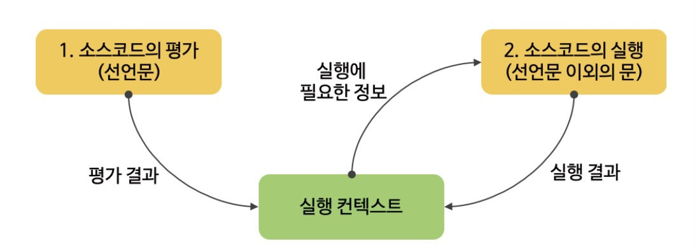
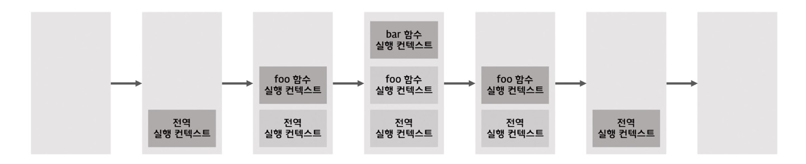
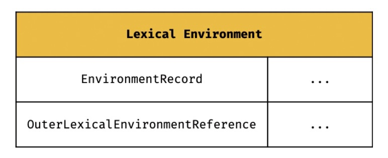

## 🗂️ 23장. 실행 컨텍스트

### 목차
- [23.1 소스코드의 타입](#23.1)
- [23.2 소스코드의 평가와 실행](#23.2)
- [23.3 실행 컨텍스트의 역할](#23.3)
- [23.4 실행 컨텍스트 스택](#23.4)
- [23.5 렉시컬 환경](#23.5)
- [23.6 실행 컨텍스트의 생성과 식별자 검색 과정](#23.6)
- [23.7 실행 컨텍스트와 블록 레벨 스코프](#23.7)

<br />

**💡 실행 컨텍스트(execution context)**: 자바 스크립트의 동작 원리를 담고 있는 핵심 개념
- 바르게 이해하면 자바스크립트가 스코프를 기반으로 식별자와 식별자에 바인딩된 값을 관리하는 방식, 호이스팅이 발생하는 이유, 클로저의 동작 방식, 태스크 큐와 함께 동작하는 이벤트 핸들러와 비동기 처리의 동작 방식 이해 가능!


### 23.1 소스코드의 타입<a name="23.1"></a>
---
- ECMAScript code를 4가지 타입으로 구분(소스코드의 타입에 따라 실행 컨텍스트를 생성하는 과정과 관리 내용이 다르기 때문)

#### ✅ 전역 코드 (global code)
- 전역에 존재하는 소스코드, 전역에 정의된 함수, 클래스 등의 내부 코드는 포함되지 않음
- 전역 변수를 관리하기 위해 최상위 스코프인 전역 스코프를 생성
- var 키워드로 선언된 전역 변수와 함수 선언문으로 정의된 전역 함수를 전역 객체와 연결

#### ✅ 함수 코드 (function code)
- 함수 내부에 존재하는 소스코드, 함수 내부에 중첩된 함수, 클래스 등의 내부 코드는 포함되지 않음
- 지역 스코프를 생성하고 지역 변수, 매개변수, arguments 객체를 관리
- 생성한 지역 스코프를 전역 스코프에서 시작하는 스코프 체인의 일원으로 연결

#### ✅ eval 코드 (eval code)
- 빌트인 전역 함수인 eval 함수에 인수로 전달되어 실행되는 소스코드
- strict mode에서 자신만의 독자적인 스코프를 생성
#### ✅ 모듈 코드 (module code)
- 모듈 내부에 존재하는 소스코드, 모듈 내부의 함수, 클래스 등의 내부 코드는 포함되지 않음
- 모듈별로 독립적인 모듈 스코프를 생성

### 23.2 소스코드의 평가와 실행<a name="23.2"></a>
---


#### ✅ 평가
- 실행 컨텍스트를 생성
- 변수, 함수 등의 선언문만 먼저 실행하여 생성된 변수나 함수 식별자를 키로 실행 컨텍스트가 관리하는 스코프에 등록
#### ✅ 실행
- 선언문을 제외한 소스코드가 순차적으로 실행 -> **런타임**
- 소스코드 실행에 필요한 정보, 즉 변수나 함수의 참조를 실행 컨텍스트가 관리하는 스코프에서 검색에서 취득
- 변수 값의 변경 등 소스 코드의 실행 결과난 다시 실행 컨텍스트가 관리하는 스코프에 등록

### 23.3 실행 컨텍스트의 역할<a name="23.3"></a>
---
- **코드가 실행되기 위해서 스코프, 식별자, 코드 실행 순서 등의 관리가 필요**
1. 선언에 의해 생성된 모든 식별자를 스코프를 구분하여 등록하고 상태 변화를 지속적으로 관리
2. 스코프는 중첩 관계에 의해 스코프 체인을 형성, 스코프 체인을 통해 상위 스코프로 이동하며 식별자 검색 가능
3. 현재 실행 중인 코드의 실행 순서를 변경할 수 있어야 하며 다시 되돌아갈 수도 있어야 함
- 소스 코드를 실행하는 데 필요한 환경을 제공하고 코드의 실행 결과를 실제로 관리하는 영역
- **식별자(변수, 함수, 클래스 등의 이름)를 등록하고 관리하는 스코프와 코드 실행 순서 관리를 구현한 내부 메커니즘**

### 23.4 실행 컨텍스트 스택<a name="23.4"></a>
---
#### ✅ 코드 실행순서 관리



- 자바스크립트 엔진은 전역 코드를 평가하여 `전역 실행 컨텍스트`를 생성 -> 함수가 호출되면 함수 코드를 평가하여 `함수 실행 컨텍스트`를 생성
- 실행 컨텍스트는 **스택 자료구조로 관리**
- 실행 컨텍스트 스택의 **최상위에 존재**하는 실행 컨텍스트는 언제나 **현재 실행 중인 코드의 실행 컨텍스트**

### 23.5 렉시컬 환경<a name="23.5"></a>
---
#### ✅ 식별자와 스코프 관리
  

- 식별자와 식별자에 바인딩된 값, 그리고 상위 스코프에 대한 참조를 기록하는 자료구조
- 키와 값을 갖는 객체 형태의 스코프를 생성하고 관리
- **스코프를 구분하여 식별자를 등록하고 관리하는 저장소 역할**을 하는 렉시컬 스코프의 실체

**1. 환경 레코드(Environment Record)**
- 스코프에 포함된 식별자를 등록하고 등록된 식별자에 바인딩된 값을 관리하는 저장소
- 소스코드의 타이벵 따라 관리하는 내용에 차이 존재

**2. 외부 렉시컬 환경에 대한 참조(Outer Lexical Environment Reference)**
- 상위 스코프(해당 실행 컨텍스트를 생성한 소스코드를 포함하는 상위 코드의 렉시컬 환경)를 가리킴
- 단방향 링크드 리스트인 스코프 체인 구현

### 23.6 실행 컨텍스트의 생성과 식별자 검색 과정<a name="23.6"></a>
---
```js
var x = 1;
const y = 2;

function foo (a) {
  var x = 3;
  const y = 4;

  function bar (b) {
    const z = 5;
    console.log(a + b + x + y + z);
  }
  bar(10);
}
foo(20); // 42
```

#### ✅ 전역 객체 생성
- 전역 코드가 평가되기 이전에 생성
- 빌트인 전역 프로퍼티, 빌트인 전역 함수, 표준 빌트인 객체, 동작 환경에 따라 클라이언트 사이드 Web API 또는 특정 환경을 위한 호스트 객체 포함

#### ✅ 전역 코드 평가
1. 전역 실행 컨텍스트 생성
- 비어 있는 전역 실행 컨텍스트를 생성하여 실행 컨텍스트에 스택에 푸시

2. 전역 렉시컬 환경 생성
- 전역 렉시컬 환경을 생성하고 전역 실행 컨텍스트에 바인딩

  1. 전역 환경 레코드 생성  
      1. 객체 환경 레코드 생성
        - 전역 코드 평가 과정에서 var키워드로 선언한 전역 변수와 함수 선언문으로 정의된 전역 함수는 전역 환경 레코드의 객체 환경 레코드에 연결된 BindingObject를 통해 전역 객체의 프로퍼티와 메서드
        
        -  **❗ var 키워드로 선언한 변수, 함수 선언문으로 정의한 함수가 선언문 이전에도 참조 가능한 이유**

        - 변수 호이스팅 VS 함수 호이스팅
        : 변수 선언문 이전에 참조한 변수의 값은 언제나 undefined, 함수는 생성된 함수 객체를 즉시 할당
      
      2. 선언적 환경 레코드 생성
      - let, const 키워드로 선언한 전역 변수가 등록되고 관리
      - let, const 키워드로 선언한 변수도 변수 호이스팅이 발생하나, **런타임에 컨트롤이 변수 선언문에 도달하기 전까지 일시적 사각지대에 빠지기 때문에 참조 불가능**

  2. this 바인딩

  3. 외부 렉시컬 환경에 대한 참조 결정
    - 현재 평가 중인 소스코드를 포함하는  외부 소스코드의 렉시컬 환경
    - 전역 렉시컬 환경의 외부 렉시컬 환경에 대한 참조에 null이 할당 -> **전역 렉시컬 환경이 스코프 체인의 종점에 존재함을 의미**

#### ✅ 전역 코드 실행
- 식별자 결정(identifier resolution) : 동일한 이름의 식별자가 다른 스코프에 여러개 존재 가능하므로, 어느 스코프의 식별자를 참조하면 되는지 결정
- 식별자 걸정을 위해 식별자를 검색할 대는 실행 중인 컨텍스트에서 식별자를 검색하기 시작
- 만약 실행 중인 실행 컨텍스트의 렉시컬 환경에서 식별자 검색이 불가능하면 상위 스코프로 이동하여 식별자 검색
- 전역 렉시컬 환경(스코프 체인의 종점)에서 검색할 수 없는 식별자는 참조 에러 

#### ✅ foo 함수 코드 평가
- foo 함수가 호출되면 전역 코드의 실행을 일시 중단하고 foo 함수 내부로 코드 제어권 이동

1. 함수 실행 컨텍스트 생성

2. 함수 렉시컬 환경 생성
    1. 함수 환경 레코드 생성  
      - 매개변수, arguments 객체, 함수 내부에서 선언한 지역 변수와 중첩 함수를 등록하고 관리
    2.  this 바인딩

    3. 외부 렉시컬 환경에 대한 참조 결정
      - `함수를 어디서 호출했는지가 아니라 어디에 정의했는지에 따라 상위 스코프 결정`
      - 현재 실행 중인 실행 컨텍스트의 렉시컬 환경, 즉 함수의 상위 스코프를 함수 객체의 내부 슬롯 [[Environment]]에 저장
      - 외부 렉시컬 환경에 대한 참조에 할당되는 것은 함수의 상위 스코프를 가리키는 함수 객체의 내부 슬롯 [[Environment]]에 저장된 렉시컬 환경의 참조

#### ✅ foo 함수 코드 실행
- 런타임이 시작되어 foo 함수의 소스코드가 순차적으로 실행
- foo 함수 렉시컬 환경에서 식별자 x, y를 검색하기 시작

#### ✅ bar 함수 코드 평가
- bar 함수가 호출되면 bar 함수 내부로 코드의 제어권 이동

#### ✅ bar 함수 코드 실행
- 런타임이 시작되어 bar 함수의 소스코드가 순차적으로 실행
- 매개변수에 인수가 할당되고, 변수 할당문이 실행되어 지역 변수 z에 값이 할당

1. console 식별자 검색

    bar 함수 렉시컬 환경 -> foo 함수 렉시컬 환경 -> 전역 렉시컬 환경  

2. log 메서드 검색
3. 표현식 a + b + x + y + z의 평가
4. console.log 메서드 호출

#### ✅ bar 함수 코드 실행 종료
- 실행 컨텍스트 스택에서 bar 함수 실행 컨텍스트가 팝되어 제거되고, foo 실행 컨텍스트가 실행 중인 실행 컨텍스트가 됨
- bar 함수 렉시컬 환경은 독립적인 객체, 누군가 참조하고 있다면 즉시 소멸하는 것은 아님

#### ✅ foo 함수 코드 실행 종료
- 실행 컨텍스트 스택에서 foo 함수 실행 컨텍스트가 팝되어 제거되고, 전역 실행 컨텍스트가 실행 중인 실행 컨텍스트가 됨

#### ✅ 전역 코드 실행 종료
- 전역 코드 실행 종료, 전역 실행 컨텍스트도 실행 컨텍스트 스택에서 팝되어 아무것도 남아있지 않음

### 23.7 실행 컨텍스트와 블록 레벨 스코프<a name="23.7"></a>
---

