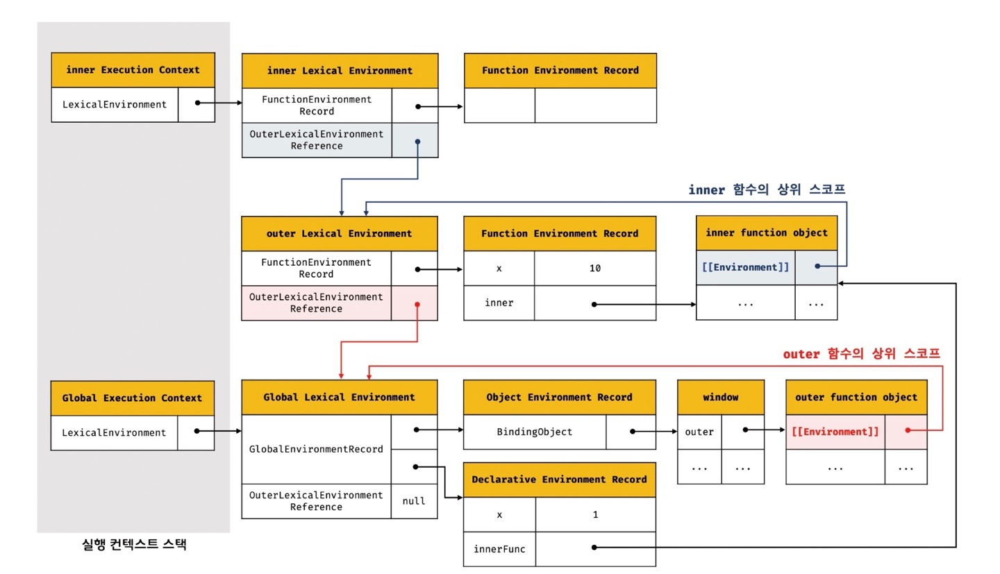

## 🗂️ 24장. 클로저

### 목차
- [24.1 렉시컬 스코프](#24.1)
- [24.2 함수 객체의 내부 슬롯[[Environment]]](#24.2)
- [24.3 클로저와 렉시컬 환경](#24.3)
- [24.4 클로저의 활용](#24.4)
- [24.5 캡슐화와 정보 은닉](#24.5)
- [24.6 자주 발생하는 실수](#24.6)

<br />

**💡 클로저(closure)**: 함수와 그 함수가 선언된 렉시컬 환경과의 조합
- 자바스크립트 고유의 개념이 아니라, 함수를 일급 객체로 취급하는 함수형 프로그래밍 언어(하스켈, 리스프, 얼랭, 스칼라 등)에서 사용되는 중요한 특성


### 24.1 렉시컬 스코프<a name="24.1"></a>
---
#### ✅ 렉시컬 스코프(정적 스코프): 함수를 어디서 호출했는지가 아니라 **함수를 어디에 정의했는지**에 따라 상위 스코프를 결정

- 함수의 상위 스코프는 함수를 정의한 위치에 의해 정적으로 결정되고 변하지 않음

- 렉시컬 환경의 **외부 렉시컬 환경에 대한 참조**에 저장할 값, 즉 상위 스코프에 대한 참조는 **❗함수 정의가 평가되는 시점에 함수가 정의된 환경(위치)에 의해 결정**

### 24.2 함수 객체의 내부 슬롯 [[Environment]]<a name="24.2"></a>
---
#### ✅ 함수가 정의된 환경과 호출되는 환경은 다를 수 있으며 **함수 정의가 평가되어 함수 객체를 생성할 때 자신의 내부 슬롯 [[Environment]]에 자신이 정의된 환경, 즉 상위 스코프**의 참조를 저장

- 함수 객체의 내부 슬롯 [[Environment]]에 저장된 현재 실행 중인 실행 컨텍스트의 렉시컬 환경의 참조가 바로 상위 스코프
- 자신이 호출 되었을 때 생성될 함수 렉시컬 환경의 외부 렉시컬 환경에 대한 참조

```js
const x = 1;

function foo() {
  const x = 10;

  // 상위 스코프는 함수 정의 환경(위치)에 따라 결정
  // 함수 호출 위치와 상위 스코프는 아무런 관계가 없음
  bar();
}

// 함수 bar는 자신의 상위 스코프, 즉 전역 렉시컬 환경을 [[Environment]]에 저장하여 기억
function bar() {
  console.log(x);
}

foo(); // ?
bar(); // ?
```


➡️ ①은 전역 코드 평가 시점에서 foo와 bar함수 객체가 생성되며 각 함수 객체의 내부 슬롯 [[Environment]]에 상위 스코프가 저장

➡️ ② foo함수의 렉시컬 환경이 생성되며 외부 렉시컬 환경 환경에 대한 참조에 전역 렉시컬 환경의 참조(함수 객체의 내부 슬롯 [[Environment]]에 저장된)가 저장

➡️ ③ bar함수의 렉시컬 환경이 생성되며 외부 렉시컬 환경 환경에 대한 참조에 전역 렉시컬 환경의 참조(함수 객체의 내부 슬롯 [[Environment]]에 저장된)가 저장

### 24.3 클로저와 렉시컬 환경<a name="24.3"></a>
---
#### ✅ 외부 함수보다 중첩 함수가 더 오래 유지되는 경우, 중첩 함수는 이미 생명 주기가 종료한 외부 함수의 변수를 참조 가능
#### 중접 함수 : 클로저(closure)

```js
const x = 1;

// ①
function outer() {
  const x = 10;
  const inner = function () { console.log(x); }; // ②
  return inner;
}

// outer 함수를 호출하면 중첩 함수 inner를 반환
// 그리고 outer 함수의 실행 컨텍스트는 실행 컨텍스트 스택에서 팝되어 제거
const innerFunc = outer(); // ③
innerFunc(); // ④ 10
```

➡️ ③에서 outer함수를 호출하면 outer함수는 중첩 함수inner를 반환하고 생명 주기를 마감, 그러나 ④에서 inner함수 호출 결과는 outer함수의 지역 변수 x의 값인 10




#### ✅ 클로저는 중첩 함수가 상위 스코프의 식별자를 참조하고 있고 중첩 함수가 외부 함수보다 더 오래 유지되는 경우에 한정하는 것이 일반적!
➡️ `자유 변수(free variable)`: 클로저에 의해 참조되는 상위 스코프의 변수

➡️ 클로저란 함수가 자유 변수에 대해 닫혀있다(closed)라는 의미, "자유 변수에 묶여있는 함수"

### 24.4 클로저의 활용<a name="24.4"></a>
---
#### ✅ 클로저는 상태(state)를 안전하게 변경하고 유지하기 위해 사용

#### ✅ 상태를 안전하게 은닉(information hiding)하고 특정 함수에게만 상태 변경을 허용하기 위해 사용
➡️ 전역 변수로 관리, 언제든지 누구나 접근하여 변경이 가능하기 때문에 오류 가능성 존재
```js
// 카운트 상태 변수
let num = 0;

// 카운트 상태 변경 함수
const increase = function () {
  // 카운트 상태를 1만큼 증가
  return ++num;
};

console.log(increase()); // 1
console.log(increase()); // 2
console.log(increase()); // 3
```

➡️ 함수의 지역 변수로 관리, 함수가 호출될 때마다 지역 변수num은 다시 선언되어 0으로 초기화되기 때문에 상태를 유지하지 못함
```js
// 카운트 상태 변경 함수
const increase = function () {
  // 카운트 상태 변수
  let num = 0;

  // 카운트 상태를 1만큼 증가
  return ++num;
};

// 이전 상태를 유지하지 못한다.
console.log(increase()); // 1
console.log(increase()); // 1
console.log(increase()); // 1
```


➡️ 클로저 활용, 클로저로 num의 상태를 은닉하여 의도치 않게 변경되지 않도록 안전하게 관리하고 특정 함수에게만 상태 변경을 허용하여 상태를 안전하게 변경하고 유지
```js
// 카운트 상태 변경 함수
const increase = (function () {
  // 카운트 상태 변수
  let num = 0;

  // 클로저
  return function () {
    // 카운트 상태를 1만큼 증가
    return ++num;
  };
}());

console.log(increase()); // 1
console.log(increase()); // 2
console.log(increase()); // 3
```
### 24.5 캡슐화와 정보 은닉<a name="24.5"></a>
---
#### ✅ 캡슐화: 객체의 상태를 나타내는 프로퍼티와 프로퍼티를 참조하고 조작할 수 있는 동작인 메서드를 하나로 묶는 것
#### ✅ 정보 은닉: 캡슐화는 객체의 특정 프로퍼티나 메서드를 감출 목적으로 사용

➡️ `정보 은닉`은 외부에 공개할 필요가 없는 구현의 일부를 외부에 공개되지 않도록 감추어 적절치 못한 접근으로부터 객체의 상태가 변경되는 것을 방지해 정보를 보호하고, 객체 간의 상호 의존성, 즉 결합도(coupling)를 낮추는 효과!

```js
const Person = (function () {
  let _age = 0; // private

  // 생성자 함수
  function Person(name, age) {
    this.name = name; // public
    _age = age;
  }

  // 프로토타입 메서드
  Person.prototype.sayHi = function () {
    console.log(`Hi! My name is ${this.name}. I am ${_age}.`);
  };

  // 생성자 함수를 반환
  return Person;
}());

const me = new Person('Lee', 20);
me.sayHi(); // Hi! My name is Lee. I am 20.
console.log(me.name); // Lee
console.log(me._age); // undefined

const you = new Person('Kim', 30);
you.sayHi(); // Hi! My name is Kim. I am 30.
console.log(you.name); // Kim
console.log(you._age); // undefined
```

➡️ 즉시 실행 함수로 감싸서 그 안에 지역 변수 _age를 선언하고 그 안에 Person생성자 함수와 프로토타입 메서드를 선언하고 생성자 함수를 반환

➡️ 즉시 실행 함수는 종료되었지만 반환된 Person생성자 함수는 여전히 지역 변수_age를 참조할 수 있는 클로저

### 24.6 자주 발생하는 실수<a name="24.6"></a>
---
#### ✅ for문을 사용할 때 for문 내부에 함수를 선언하는 경우 

```js
var funcs = [];

for (var i = 0; i < 3; i++) {
  funcs[i] = function () { return i; }; // ①
}

for (var j = 0; j < funcs.length; j++) {
  console.log(funcs[j]()); // ②
}
```

➡️ `0 1 2`가 출력될 것을 기대하였지만 `3 3 3`이 출력

➡️ `var`로 선언된 i변수는 전역 변수로 선언되었기 때문에 함수 선언문에 i값을 전달하였더라도, 호출하는 시점에는 i값이 3이기 때문에 3 3 3이 출력

#### ✅ 클로저를 사용해 바르게 고치면

```js
var funcs = [];

for (var i = 0; i < 3; i++){
  funcs[i] = (function (id) { // ①
    return function () {
      return id;
    };
  }(i));
}

for (var j = 0; j < funcs.length; j++) {
  console.log(funcs[j]());
}
```

➡️ for문 내부에 함수를 선언할 때 즉시 실행 함수로 감싸고 i값을 전달해 주도록 수정

➡️ id는 즉시 실행 함수가 반환한 중첩 함수에 묶여있는 자유 변수가 되어 그 값이 유지

➡️ 더욱 간단하게 하는 방법은 ES6의 `let`키워드를 사용하는 것, let 키워드는 `블록 레벨 스코프를` 따르기 때문에 for문이 반복될 때 마다 새로운 렉시컬 환경이 생성