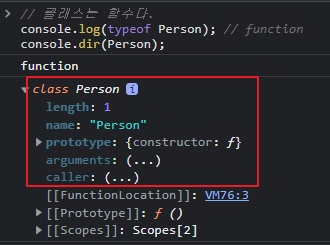
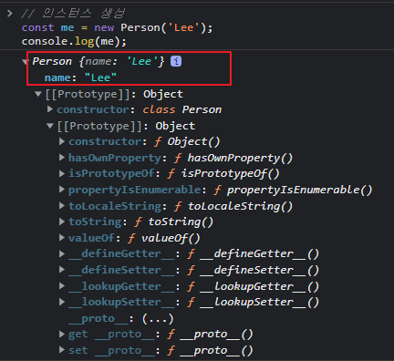

## 🗂️ 25장. 클래스

### 목차
- [25.1 클래스는 프로토타입의 문법적 설탕인가?](#25.1)
- [25.2 클래스 정의](#25.2)
- [25.3 클래스 호이스팅](#25.3)
- [25.4 인스턴스 생성](#25.4)
- [25.5 메서드](#25.5)
- [25.6 클래스의 인스턴스 생성 과정](#25.6)
- [25.7 프로퍼티](#25.7)
- [25.8 상속에 의한 클래스 확장](#25.8)

<br />

### 25.1 클래스는 프로토타입의 문법적 설탕인가?<a name="25.1"></a>
---
> 💡 자바스크립트는 **프로토타입 기반 객체지향 프로그래밍 언어**

- 프로토타입 기반 객체지향 언어는 클래스가 필요 없는 `class free`
- ES5에서는 클래스 없이도 생성자 함수와 프로토타입을 통해 객체지향 언어의 상속 구현 가능

```js
// ES5 생성자 함수
var Person = (function () {
  // 생성자 함수
  function Person(name) {
    this.name = name;
  }

  // 프로토타입 메서드
  Person.prototype.sayHi = function () {
    console.log('Hi! My name is ' + this.name);
  };

  // 생성자 함수 반환
  return Person;
}());

// 인스턴스 생성
var me = new Person('Lee');
me.sayHi(); // Hi! My name is Lee
```

- ES6에서 추가된 클래스가 기존의 프로토타입 기반 객체지향 모델을 폐지하고 새롭게 클래스 기반 객체지향 모델을 제공하는 것은 아님!

#### ✅ 클래스와 생성자 함수는 모두 프로토타입 기반의 인스턴스를 생성하지만 정확히 동일하게 동작하지는 않음

#### ✅ 따라서 클래스를 프로토타입 기반 객체 생성 패턴의 단순한 문법적 설탕이라고 보기보다는 **새로운 객체 생성 메커니즘**으로 보는 것이 합당

| 특징                                   | 클래스                                                       | 생성자 함수                                        |
|----------------------------------------|--------------------------------------------------------------|----------------------------------------------------|
| 'new' 연산자 없이 호출 시              | 에러 발생                                                    | 일반 함수처럼 호출됨                               |
| 'extends' 및 'super'로 상속 지원       | 지원                                                         | 지원하지 않음                                      |
| 호이스팅 동작                          | 호이스팅 없음 (함수처럼 선언이 최상단으로 끌어올려지지 않음) | 호이스팅 발생                                      |
| Strict 모드                            | 클래스 내의 모든 코드는 암묵적으로 Strict 모드 지정, 해제 X  | 암묵적으로 Strict 모드가 지정되지 않음             |
| 프로퍼티 열거 가능 여부                | constructor, 프로토타입 메서드, 정적 메서드는 열거되지 않음  | 프로퍼티는 기본적으로 열거 가능                    |

### 25.2 클래스 정의<a name="25.2"></a>
---
#### ✅ 클래스는 `class` 키워드를 사용하여 정의, 일반적으로 파스칼 케이스 사용(사용하지 않아도 에러는 발생 X)
```js
// 클래스 선언문 
class Person {}
```

- 함수와 마찬가지로 표현식으로 정의 가능(일반적이지 않고, 이름을 갖을 수도 갖지 않을 수도 있음)
```js
// 익명 클래스 표현식
const Person = class {};

// 기명 클래스 표현식
const Person = class MyClass {};
```
#### ✅ 표현식으로 정의할 수 있다는 것은 **클래스가 값으로 사용할 수 있는 일급 객체라는 것**을 의미 

  **일급 객체의 특징**
  - 무명의 리터럴로 생성 가능
  - 변수나 자료구조에 저장 가능
  - 함수의 매개변수에게 전달 가능
  - 함수의 반환값으로 사용 가능

#### ✅ 클래스 몸체에는 0개 이상의 메서드만 정의 가능, `constructor(생성자), 프로토타입 메서드, 정적 메서드`정의 가능
```js
// 클래스 선언문
class Person {
  // 생성자
  constructor(name) {
    // 인스턴스 생성 및 초기화
    this.name = name; // name 프로퍼티는 public
  }

  // 프로토타입 메서드
  sayHi() {
    console.log(`Hi! My name is ${this.name}`);
  }

  // 정적 메서드
  static sayHello() {
    console.log('Hello!');
  }
}

// 인스턴스 생성
const me = new Person('Lee');

// 인스턴스의 프로퍼티 참조
console.log(me.name); // Lee
// 프로토타입 메서드 호출
me.sayHi(); // Hi! My name is Lee
// 정적 메서드 호출
Person.sayHello(); // Hello!
```

### 25.3 클래스 호이스팅<a name="25.3"></a>
---

#### ✅ 클래스는 함수로 평가!
```js
// 클래스 선언문
class Person {}

console.log(typeof Person); // function
```
- 클래스 선언문으로 정의한 클래스는 함수 선언문과 같이 **소스코드 평가 과정, 즉 런타임 이전에 먼저 평가되어 함수 객체를 생성**
- 이 때 클래스가 평가되어 생성된 함수 객체는 constructor(생성자 함수로서 호출할 수 있는 함수)
- 클래스는 `let, const` 키워드로 선언한 변수처럼 호이스팅 발생하지만, 선언문 이전에 일시적 사각지대에 빠지기 때문에 호이스팅 발생하지 않는 것처럼 동작
```js
const Person = '';

{
  // 호이스팅이 발생하지 않는다면 ''이 출력되어야 한다.
  console.log(Person);
  // ReferenceError: Cannot access 'Person' before initialization

  // 클래스 선언문
  class Person {}
}
```
> 즉, 모든 선언문은 런타임 이전에 먼저 실행되기 때문에 `var`, `let`, `const`, `function`, `functinon*`, `class` 키워드를 사용하여 선언된 모든 식별자는 호이스팅 됨!

### 25.4 인스턴스 생성<a name="25.4"></a>
---
#### ✅ 클래스는 생성자 함수, 반드시 `new`연산자와 함께 호출되어 인스턴스 생성
➡️ 함수는 new 연산자의 사용 여부에 따라 일반 함수로 호출되거나, 인스턴스 생성을 위한 생성자 함수로 호출

```js
class Person {}

// 인스턴스 생성
// new 연산자 없이 호출하면 타입 에러 발생!
const me = new Person();
console.log(me); // Person {}
```

#### ✅ 클래스 표현식으로 정의된 클래스의 경우, 클리스를 가리키는 식별자를 사용해 인스턴스 생성
```js
const Person = class MyClass {};

// 함수 표현식과 마찬가지로 클래스를 가리키는 식별자로 인스턴스를 생성
const me = new Person();

// 클래스 이름 MyClass는 함수와 동일하게 클래스 몸체 내부에서만 유효한 식별자
console.log(MyClass); // ReferenceError: MyClass is not defined
```

### 25.5 메서드<a name="25.5"></a>
---
#### ✅ 클래스 몸체에 정의할 수 있는 메서드: `constructor(생성자)`, `프로토타입 메서드`, `정적 메서드`
> ECMAScript 사양에 따르면 인스턴스 프로퍼티는 반드시 constructor 내부에서 정의해야 하지만, 클래스 몸체에 메서드뿐만이 아니라 **프로퍼티를 직접 정의할 수 있는 새로운 표준 사양 제안** (최신 모던 브라우저에는 이미 사용 가능!)

### 25.5.1 constructor

➡️ constructor는 인스턴스를 생성하고 초기화하기 위한 특수한 메서드, 이름 변경 불가능

➡️ 클래스가 평가되어 생성된 함수 객체나, 클래스가 생성된 인스턴스에는 constructor메서드 존재 X, constructor는 메서드로 해석되지 않고 클래스가 평가되어 생성한 함수 객체 코드의 일부!

```js
class Person {
  // 생성자
  constructor(name) {
    // 인스턴스 생성 및 초기화
    this.name = name;
  }
}

// 클래스는 함수
console.log(typeof Person); // function
console.dir(Person);

// 인스턴스 생성
const me = new Person('Lee');
console.log(me);
```




> 클래스의 `constructor메서드`와 `프로토타입의 counstructor프로퍼티`는 이름이 같아 혼동하기 쉽지만 직접적인 관련이 없음!


➡️ constructor는 클래스 내에 최대 한 개만 존재 가능, 2개 이상 포함하면 문법 에러 발생

➡️ constructor는 생략 가능
```js
class Person {
  // constructor를 생략하면 다음과 같이 빈 constructor가 암묵적으로 정의
  constructor() {}
}

// 빈 객체가 생성
const me = new Person();
console.log(me); // Person {}

```
➡️ 프로퍼티가 추가되어 초기화된 인스턴스를 생성하려면 constructor 내부에서 this에 인스턴스 프로퍼티 추가, 이 때는 생략 불가능
```js
class Person {
  constructor(name, address) {
    // 인수로 인스턴스 초기화
    this.name = name;
    this.address = address;
  }
}

// 인수로 초기값 전달, 초기값은 constructor에 전달
const me = new Person('Lee', 'Seoul');
console.log(me); // Person {name: "Lee", address: "Seoul"}
```

➡️ constructor는 별도의 반환문을 갖지 않아야 함(내부에서 생성자 함수와 동일하게 암묵적으로 this를 반환)

### 25.5.2 프로토타입 메서드
#### ✅ 클래스 몸체에서 정의한 메서드는 기본적으로 프로토타입 메서드(생성자 함수에 의한 객체 생성방식과 다르게 prototype 프로퍼티에 메서드를 추가하지 않아도 됨)
```js
class Person {
  // 생성자
  constructor(name) {
    // 인스턴스 생성 및 초기화
    this.name = name;
  }

  // 프로토타입 메서드
  sayHi() {
    console.log(`Hi! My name is ${this.name}`);
  }
}

const me = new Person('Lee');
me.sayHi(); // Hi! My name is Lee
```
➡️ 생성자 함수와 마찬가지로, 클래스가 생성한 인스턴스는 프로토타입 체인의 일원**

### 25.5.3 정적 메서드
#### ✅ 인스턴스를 생성하지 않아도 호출할 수 있는 메서드

#### ✅ 클래스에서는 `static`키워드를 붙이면 정적 메서드(클래스 메서드)
```js
class Person {
  // 생성자
  constructor(name) {
    // 인스턴스 생성 및 초기화
    this.name = name;
  }

  // 정적 메서드
  static sayHi() {
    console.log('Hi!');
  }
}

// 정적 메서드는 클래스로 호출
// 정적 메서드는 인스턴스 없이도 호출 가능
Person.sayHi(); // Hi!

// 정적 메서드는 인스턴스로 호출 불가능
const me = new Person('Lee');
me.sayHi(); // TypeError: me.sayHi is not a function
```
➡️ 정적 메서드는 클래스에 바인딩된 메서드

➡️ 클래스는 클래스 정의가 평가되는 시점에 함수 객체가 되므로 자신의 프로퍼티/메서드 소유 가능, 별다른 생성과정 필요 X

➡️ 정적 메서드가 바인딩된 클래스는 인스턴스의 프로토타입 체인 상에 클래스 존재하지 않기 때문에, 인스턴스로 클래스의 메서드 상속 불가능

### 25.5.4 정적 메서드와 프로토타입 메서드의 차이

| 특징                              | 정적 메서드                                            | 프로토타입 메서드                                          |
|-----------------------------------|-------------------------------------------------------|-----------------------------------------------------------|
| 프로토타입 체인 소속               | 클래스에 속함 (클래스의 프로토타입 체인 내부)          | 인스턴스에 속함 (인스턴스의 프로토타입 체인 내부)          |
| 호출 방법                          | 클래스로 직접 호출 (`Square.area(10, 10)`)         | 인스턴스를 통해 호출 (`square.area()`)     |
| 'this'를 통한 인스턴스 프로퍼티 접근 | 불가능 (정적 메서드 내에서 'this'는 undefined 또는 클래스 자체) | 가능 (프로토타입 메서드 내에서 'this'는 인스턴스를 가리킴)   |

```js
class Square {
  // 정적 메서드
  static area(width, height) {
    return width * height;
  }
}

console.log(Square.area(10, 10)); // 100

------------------------------------------

class Square {
  constructor(width, height) {
    this.width = width;
    this.height = height;
  }

  // 프로토타입 메서드
  area() {
    return this.width * this.height;
  }
}

const square = new Square(10, 10);
console.log(square.area()); // 100
```

#### ✅ 표준 빌트인 객체의 정적 메서드
- 애플리케이션 전역에서 사용할 유틸리티 함수
- 클래스 또는 생성자 함수를 하나의 네임스페이스로 사용하여 정적 메서드를 모아 놓으면 충돌 최소화 및 함수 구조화 가능

```js
// 표준 빌트인 객체의 정적 메서드
Math.max(1, 2, 3);          // -> 3
Number.isNaN(NaN);          // -> true
JSON.stringify({ a: 1 });   // -> "{"a":1}"
Object.is({}, {});          // -> false
Reflect.has({ a: 1 }, 'a'); // -> true
```

### 25.5.5 클래스에서 정의한 메서드의 특징

- `function`키워드를 `생략`한 `메서드 축약 표현`을 사용
- 객체 리터럴과는 다르게 클래스에 메서드를 정의할 때는 콤마가 필요 없음!
- 암묵적으로 `strict mode로` 실행
- `for...in문`이나 `Object.keys메서드` 등으로 열거불가능 ([[Enumerable]]값이 false)
-  내부 메서드 [[Construct]]를 갖지 않는 `non-constructor` (new연산자와 함께 호출 불가능)

### 25.6 클래스의 인스턴스 생성 과정<a name="25.6"></a>
---
#### ✅ 인스턴스 생성과 this 바인딩
- `new`연산자와 함께 클래스를 호출하면 암묵적으로 빈 객체(미완성) 생성
- 클래스가 생성한 인스턴스의 프로토타입으로 클래스의 prototype 프로퍼티가 가리키는 객체 설정
- 암묵적으로 생성된 빈 객체, 즉 인스턴스는 `this`에 바인딩

#### ✅ 인스턴스 초기화
- constructor 내부의 코드가 실행되며 `this에 바인딩되어 있는 인스턴스를 초기화`
- 인스턴스에 프로퍼티 추가하고 인수로 전달받은 초기값으로 인스턴스 프로퍼티 값을 초기화

#### ✅ 인스턴스 반환
- 클래스의 모든 처리가 끝나면 완성된 인스턴스가 바인딩된 this가 암묵적으로 반환

```js
class Person {
  // 생성자
  constructor(name) {
    // 1. 암묵적으로 인스턴스가 생성되고 this에 바인딩
    console.log(this); // Person {}
    console.log(Object.getPrototypeOf(this) === Person.prototype); // true

    // 2. this에 바인딩되어 있는 인스턴스를 초기화
    this.name = name;

    // 3. 완성된 인스턴스가 바인딩된 this가 암묵적으로 반환
  }
}
```

### 25.7 프로퍼티<a name="25.7"></a>
---
#### 25.7.1 인스턴스 프로퍼티
#### ✅ 인스턴스 프로퍼티는 `constructor` 내부에서 정의

```js
class Person {
  constructor(name) {
    // 내부의 this는 클래스가 생성한 빈 객체(인스턴스)가 바인딩
    this.name = name; // name 프로퍼티는 public
  }
}

const me = new Person('Lee');
console.log(me); // Person {name: "Lee"}
console.log(me.name); // Lee
```

#### 25.7.2 접근자 프로퍼티
➡️ 접근자 프로퍼티는 클래스에서도 사용 가능

➡️ 접근자 프로퍼티는 자체적으로는 값을 갖지 않고 읽거나 저장할 때 사용하는 접근자 함수(`getter`, `setter`)로 구성

➡️ `getter`는 메서드 이름 앞에 `get`키워드를 사용해 정의, `setter`는 메서드 이름 앞에 `set`키워드를 사용해 정의

➡️ getter와 setter 이름은 인스턴스 프로퍼티처럼 사용된다.(ex `me.fullName = 'Heegun Lee';`, `console.log(me.fullName);`)

➡️ getter는 무언가를 취득할 때 사용하므로 `반드시 return`이 있어야 한다.

➡️ setter는 무언가를 프로퍼티에 할당할 때 사용하므로 `반드시 매개변수`가 있어야한다.

➡️ 접근자 프로퍼티는 인스턴스의 프로로타입이 아니라 프로토타입의 프로퍼티!
```js
class Person {
  constructor(firstName, lastName) {
    this.firstName = firstName;
    this.lastName = lastName;
  }

  // fullName은 접근자 함수로 구성된 접근자 프로퍼티
  // getter 함수
  get fullName() {
    return `${this.firstName} ${this.lastName}`;
  }

  // setter 함수
  set fullName(name) {
    [this.firstName, this.lastName] = name.split(' ');
  }
}

const me = new Person('Ungmo', 'Lee');

// 데이터 프로퍼티를 통한 프로퍼티 값의 참조
console.log(`${me.firstName} ${me.lastName}`); // Ungmo Lee

// 접근자 프로퍼티를 통한 프로퍼티 값의 저장
// 접근자 프로퍼티 fullName에 값을 저장하면 setter 함수가 호출
me.fullName = 'Heegun Lee';
console.log(me); // {firstName: "Heegun", lastName: "Lee"}

// 접근자 프로퍼티를 통한 프로퍼티 값의 참조
// 접근자 프로퍼티 fullName에 접근하면 getter 함수가 호출
console.log(me.fullName); // Heegun Lee

// fullName은 접근자 프로퍼티
// 접근자 프로퍼티는 get, set, enumerable, configurable 프로퍼티 어트리뷰트를 갖는다.
console.log(Object.getOwnPropertyDescriptor(Person.prototype, 'fullName'));
// {get: ƒ, set: ƒ, enumerable: false, configurable: true}
```
#### 25.7.3 클래스 필드 정의 제안
#### ✅ 클래스 필드(필드 또는 멤버): 클래스 기반 객체지향 언어에서 클래스가 생성할 인스턴스의 프로퍼티를 가리키는 용어
#### ✅ 자바스크립트의 클래스 몸체에는 메서드만 선언 가능, 클래스 몸체에 클래스 필드를 선언하면 문법 에러(SyntaxError)가 발생
```js
class Person {
  // 클래스 필드 정의
  name = 'Lee';
}

const me = new Person('Lee');
```
- 하지만 최신브라우저(Chrome72이상) 또는 Node.js(버전 12이상)에서는 정상 동작
- 자바스크립트에서도 인스턴스 프로퍼티를 마치 클래스 기반 객체지향 언어의 클래스 필드처럼 정의할 수 있는 새로운 표준 사양인 “Class field declarations“가 TC39프로세스의 stage 3(candidate)에 제안되어 있기 때문

```js
class Person {
  // 클래스 필드를 정의하는 경우 this에 바인딩 해서는 안됨, 참조하는 경우 this는 반드시 사용
  // 클래스 필드에 문자열을 할당
  name = 'Lee';

  // 클래스 필드에 함수를 할당
  // 권장되지 않음, 이 함수는 프로토타입 메서드가 아닌 인스턴스 메서드가 됨!
  getName = function () {
    return this.name;
  }
  // 화살표 함수로 정의 가능
  // getName = () => this.name;
}

const me = new Person();
console.log(me); // Person {name: "Lee", getName: ƒ}
console.log(me.getName()); // Lee
```

➡️ 인스턴스를 생성할 때 외부 초기값으로 클래스 필드를 초기화할 필요가 있다면 `constructor`에서 인스턴스 프로퍼티 정의하는 기존 방식 사용

➡️ 인스턴스를 생성할 때 외부 초기값으로 클래스 필드를 초기화할 필요가 없다면 기존 방식과 클래스 필드 정의 제안 모두 사용 가능

#### 25.7.4 private 필드 정의 제안
- 자바스크립트는 `prviate`, `public`, `protected` 키워드와 같은 접근 제한자를 지원하지 않기 때문에 `언제나 public`
- `private` 필드도 TC39 프로세스의 stage 3(candidate)로 제안
- 최신브라우저(Chrome 74이상)와 Node.js(버전 12이상)에 이미 구현
#### ✅ private필드는 이름 앞에 `#`을 붙여주며, 참조할 때도 `#`을 붙여주어야 한다.
```js
class Person {
  // private 필드 정의
  #name = '';

  constructor(name) {
    // private 필드 참조
    this.#name = name;
  }
}

const me = new Person('Lee');

// private 필드 #name은 클래스 외부에서 참조 불가능
console.log(me.#name);
// SyntaxError: Private field '#name' must be declared in an enclosing class
```

#### ✅ private필드에 직접 접근할 수 있는 방법은 없고, 접근자 프로퍼티를 통해 간접적으로 가능
```js
class Person {
  // private 필드 정의
  #name = '';

  constructor(name) {
     // private 필드는 클래스 몸체에서 정의
    this.#name = name;
  }

  // name은 접근자 프로퍼티
  get name() {
    // private 필드를 참조하여 trim한 다음 반환
    return this.#name.trim();
  }
}

const me = new Person(' Lee ');
console.log(me.name); // Lee
```

#### 25.7.5 static 필드 정의 제안
- `static`키워드를 사용하여 `static public field`, `static private field`, `static private` 메서드를 정의할 수 있는 새로운 표준 사양인 “Static class features”가 TC39 프로세스의 stage 3(candidate)에 제안
- 최신 브라우저(Chrome 72이상)와 Node.js(버전 12 이상)에 이미 구현

```js
class MyMath {
  // static public 필드 정의
  static PI = 22 / 7;

  // static private 필드 정의
  static #num = 10;

  // static 메서드
  static increment() {
    return ++MyMath.#num;
  }
}

console.log(MyMath.PI); // 3.142857142857143
console.log(MyMath.increment()); // 11
```
### 25.8 상속에 의한 클래스 확장<a name="25.8"></a>
---

#### 25.8.1 클래스 상속과 생성자 함수 상속
#### 25.8.2 extends 키워드
#### 25.8.3 동적 상속
#### 25.8.4 서브 클래스의 constructor
#### 25.8.5 super 키워드
#### 25.8.6 상속 클래스의 인스턴스 생성 과정
#### 25.8.7 표준 빌트인 생성자 함수 확장

