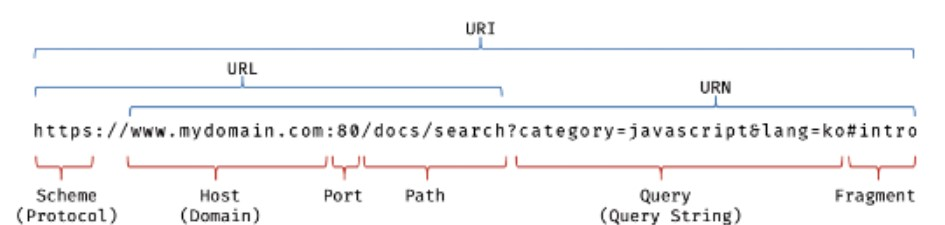
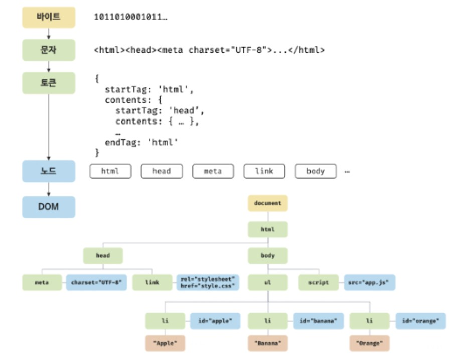
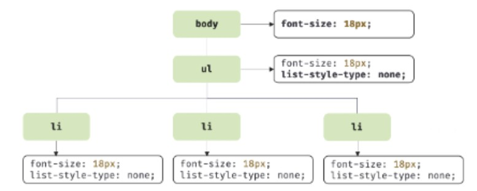
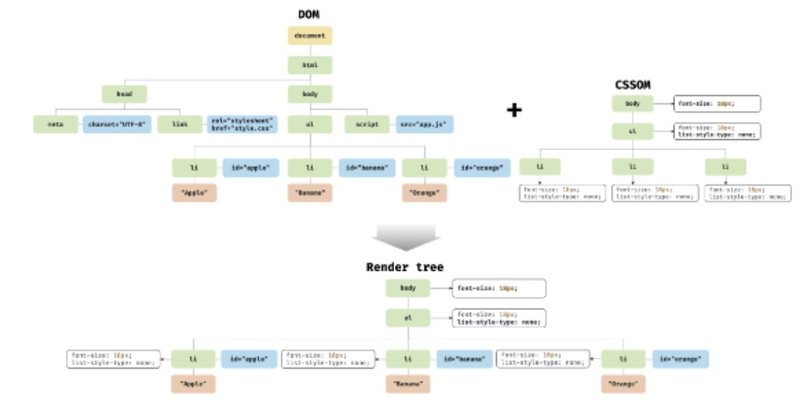
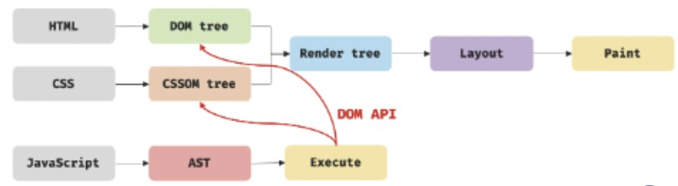

## 🗂️ 38장. 브라우저의 렌더링 과정

### 목차
- [38.1 요청과 응답](#38.1)
- [38.2 HTTP 1.1과 HTTP 2.0](#38.2)
- [38.3 HTML 파싱과 DOM 생성](#38.3)
- [38.4 CSS 파싱과 CSSOM 생성](#38.4)
- [38.5 렌더 트리 생성](#38.5)
- [38.6 자바스크립트 파싱과 실행](#38.6)
- [38.7 리플로우와 리페인트](#38.7)
- [38.8 자바스크립트 파싱에 의한 HTML 파싱 중단](#38.8)
- [38.9 script 태그의 async/defer 어트리뷰트](#38.9)

대부분의 프로그래밍 언어는 운영체제나 가상 머신위에서 실행되지만, 웹 애플리케이션의 클라이언트 사이트 자바스크립트는 브라우저에서 HTML, CSS와 함께 실행된다.

**💡파싱** : 구문 분석 syntax analysis, 텍스트 문서를 토큰으로 분해하여 트리 구조의 자료구조의 파스 트리를 생성하는 과정

**💡렌더링** : HTML, CSS, JS로 작성된 문서를 파싱하여 브라우저에 시각적으로 출력하는 것

#### ✅브라우저 렌더링 과정
1. 브라우저는 HTML, CSS, 자바스크립트, 이미지 ,폰트 파일 등 렌더링에 필요한 리소스를 요청하고 서버로부터 응답을 받는다.

2. 렌더링 엔진은 응답된 HTML, CSS를 파싱하여 DOM, CSSOM을 생성하고 이를 이용해 렌더 트리를 생성한다.

3. 자바스크립트 엔진은 서버로부터 응답된 자바스크립트를 파싱하여 AST(Abstract Syntax Tree)를 생성하고 바이트코드로 변환하여 실행한다. 자바스크립트는 DOM API를 통해 DOM, CSSOM 변경 할 수 있다.

4. 렌더 트리를 기반으로 HTML 요소의 레이아웃을 계산하고 브라우저 화면에 HTML 요소를 페인팅한다. 

### 38.1 요청과 응답
---

#### ✅브라우저 핵심 기능
**필요한 리소스를 서버에 요청하고, 서버로부터 응답받아** 브라우저에 **시각적으로 렌더링**하는 것

- 서버에 요청을 전송하기 위해 브라우저는 `주소창`을 제공

- 주소창에 URL 입력 후, 엔터 키를 누르면 URL의 호스트 이름이 DNS(Domain Name System)를 통해 IP 주소로 변환되고, IP 주소를 갖는 서버에게 요청을 전송

- 서버는 루트 요청에 대해 서버의 루트 폴더에 존재하는 정적 파일 index.html을 클라이언트로 응답함

- 브라우저의 주소창이 아닌 자바스크립트를 통해 동적으로 서버에 정적/동적 데이터 요청 가능

- 요청과 응답은 개발자 도구의 Network 패널에서 확인 가능

### 38.2 HTTP 1.1과 HTTP 2.0
---
**💡HTTP** : 웹에서 브라우저와 서버가 통신하기 위한 프로토콜(규약)

#### ✅HTTP/1.1

기본적으로 **커넥션 당 하나의 요청과 응답만 처리** 
HTML 문서 내에 포함된 여러 개의 리소스 요청/응답은 개별적으로 전송
요청할 리소스의 개수에 비례하여 응답 시간도 증가하는 단점 존재

#### ✅HTTP/2.0

**커넥션 당 여러 개의 요청과 응답 가능**, 즉 다중 요청/응답이 가능 
여러 리소스의 동시 전송이 가능해서 HTTP/1.1에 비해 페이지 로드 속도가 약 50% 정도 빠르다고 알려져 있음

### 38.3 HTML 파싱과 DOM 생성
---

#### ✅HTML파싱과 DDM 생성 과정
**DOM은 HTML 문서 파싱 결과물**
1. 서버는 브라우저가 요청한 HTML 파일을 읽어 들여 메모리에 저장한 다음 저장된 바이트(2진수)를 인터넷을 경유하여 응답

2. 브라우저는 서버로부터 응답받은 바이트(2진수) 형태의 HTML문서를 meta 태그의 charset 어트리뷰트에 지정된 인코딩 방식을 기준으로 문자열로 변환

3. 문자열로 변환된 HTML 문서를 읽어 들여 문법적 의미를 갖는 코드의 집합인 토큰(Token)으로 분해

4. 이러한 토큰을 객체로 변환하여 노드들을 생성

5. HTML 요소는 중첩 관계를 가지며, 이러한 부자관계를 반영하여 모든 노드들로 구성된 트리 자료구조를 DOM이라고 함​

### 38.4 CSS 파싱과 CSSOM 생성
---

- 렌더링 엔진은 HTML을 처음부터 한 줄씩 순차적으로 파싱하여 DOM 생성하다가, **CSS 로드 link/style 태그를 만나면 DOM 생성을 일시 중단**

- link 태그의 href 어트리뷰트에 지정된 CSS 파일을 서버에 요청하여 로드한 CSS 파일이나 style 태그 내의 CSS를 HTML과 동일한 파싱 과정(바이트 > 문자 > 토큰 > 노드 > CSSOM)을 거쳐 해석하며 CSSOM 생성

### 38.5 렌더 트리 생성
---
**💡렌더 트리** : 렌더링을 위한 트리 구조의 자료구조

- 렌더링 엔진은 DOM과 CSSOM 생성하고, DOM과 CSSOM은 렌더 트리로 결합됨

- **브라우저 화면에 렌더링되지 않는 노드와 CSS에 의해 비표시되는 노드들은 포함되지 않음**

- 완성된 렌더 트리는 각 HTML 요소의 레이아웃을 계산하는 데 사용되며 브라우저 화면에 픽셀을 렌더링하는 페인팅 처리에 입력됨

- **브라우저의 렌더링 과정은 반복해서 실행 가능**

- 아래의 경우 반복해서 레이아웃 계산과 페인팅이 재차 실행

	- 자바스크립트에 의한 노드 추가/삭제

	- 브라우저 창의 리사이징에 의한 뷰포트 크기 변경

	- HTML 요소의 레이아웃(위치, 크기)에 변경을 발생시키는 width/height, margin, padding, border, display, position, top/right/bottom/left 등 스타일 변경

**💡리렌더링** : 레이아웃 계산과 페인팅을 다시 실행
- 비용이 많이 들어 성능에 악영향을 주는 작업

- 가급적 리렌더링이 빈번하게 발생하지 않도록 주의 필요

### 38.6 자바스크립트 파싱과 실행
---

- DOM은 HTML 문서의 구조/정보 및 HTML 요소와 스타일 등을 변경할 수 있는 프로그래밍 인터페이스로서 DOM API 제공

- 렌더링 엔진은 HTML을 한 줄씩 순차적으로 파싱하며 DOM을 생성해 나가다가, **자바스크립트 파일을 로드하는 script 태그를 만나면 DOM 생성을 일시 중단**

- script 태그의 scr 어트리뷰트에 정의된 자바스크립트 파일을 서버에 요청하여 로드한 자바스크립트 파일이나 script 태그의 자바스크립트 코드를 파싱하기 위해 자바스크립트 엔진에 제어권을 넘김

- 자바스크립트 엔진은 자바스크립트를 해석하여 AST(추상적 구문 트리)를 생성

- AST를 기반으로 인터프리터가 실행할 수 있는 바이트코드(중간 코드)를 생성하여 실행

- 자바스크립트 파싱과 실행이 종료되면 렌더링 엔진으로 다시 제어권을 넘겨 HTML 파싱이 중단된 지점부터 다시 HTML 파싱을 시작하여 DOM 생성을 재개

**💡자바스크립트 엔진** : 자바스크립트 코드를 파싱하여 **CPU가 이해할 수 있는 저수준 언어**로 변환하고 실행하는 역할
 
- 구글 크롬과 Node.js의 V8 등 다양한 종류

- 모든 자바스크립트 엔진은 ECMAScript 사양을 준수

**💡토크나이징** : 단순한 문자열인 자바스크립트 코드를 어휘 분석하여 문법적 의미를 갖는 코드의 최소 단위인 토큰들로 분해

- 이 과정을 렉싱이라고도 부르기도 하나, 토크나이징과 미묘한 차이 존재

**💡파싱** :  토큰들의 집합을 구문 분석하여 AST(추상적 구문 트리)를 생성

- **AST는 토큰에 문법적 의미와 구조를 반영한 트리 구조의 자료구조**

- AST는 인터프리터나 컴파일러만이 사용하는 것은 아님

- AST를 사용 시, TypeScript, Babel, Prettier 같은 트랜스 파일러 구현 가능

- AST Explorer 웹사이트(https://astexplorer.net) 방문 시, 다양한 오픈소스 자바스크립트 파서를 사용하여 AST 생성 가능

### 38.7 리플로우와 리페인트
---

- 자바스크립트 코드에 DOM이나 CSSOM을 변경하는 DOM API가 사용된 경우, DOM이나 CSSOM이 변경됨

- 이때 변경된 DOM과 CSSOM은 다시 렌더 트리로 결합되고 변경된 렌더 트리를 기반으로 레이아웃과 페인트 과정을 거쳐 브라우저의 화면에 다시 렌더링

**💡리플로우** : 레이아웃 계산을 다시 하는 것

노드 추가/삭제 또는 요소의 크기/위치 변경, 윈도우 리사이징 등 레이아웃에 영향을 주는 변경이 발생한 경우에 한하여 실행

**💡리페인트** : 재결합된 렌더 트리를 기반으로 다시 페인트 하는 것

- 리플로우와 리페인트가 반드시 순차적으로 동시에 실행되는 것은 아님

- 레이아웃에 영향이 없는 변경은 리플로우 없이 리페인트만 실행

### 38.8 자바크립트 파싱에 의한 HTML 파싱 중단
---
- 렌더링 엔진과 자바스크립트 엔진은 병렬적으로 파싱을 실행하지 않고 **직렬적**으로 파싱 수행

- 브라우저는 동기적으로 **위에서 아래 방향으로 순차적으로** HTML, CSS, 자바스크립트를 파싱하고 실행

- script 태그의 위체에 따라 HTML 파싱이 블로킹되어 DOM 생성이 지연될 수 있음을 의미하기 때문에, script 태그 위치는 중요

#### ✅ body 요소의 가장 아래에 자바스크립트를 위치
- DOM이 완성되지 않은 상태에서 자바스크립트가 DOM 조작하면 에러가 발생가능

- 자바스크립트 로딩/파싱/실행으로 인해 HTML 요소들의 렌더링에 지장받는 일이 발생하지 않아 페이지 로딩 시간이 단축

### 38.9 script 태그의 async/defer 어트리뷰트
---
- 자바스크립트 파싱에 의한 DOM 생성이 중단되는 문제를 근본적으로 해결하기 위해 HTML5부터 script 태그에 async와 defer 어트리뷰트가 추가

- async와 defer 어트리뷰트는 외부 자바스크립트 파일을 로드하는 경우에만 사용 가능

- async와 defer 어트리뷰트를 사용하면 HTML 파싱과 외부 자바스크립트 파일의 로드가 비동기적으로 동시에 진행, 그러나 자바스크립트의 실행 시점에 차이는 존재

#### ✅async 어트리뷰트

- HTML 파싱과 외부 자바스크립트 파일의 로드가 비동기적으로 동시에 진행

- **자바스크립트의 파싱과 실행은 자바스크립트 파일의 로드가 완료된 직후 진행되며, HTML 파싱이 중단**

#### ✅ defer 어트리뷰트

- HTML 파싱과 외부 자바스크립트 파일의 로드가 비동기적으로 동시에 진행

- **자바스크립트의 파싱과 실행은 HTML 파싱이 완료된 직후(DOM 생성이 완료된 직후) 진행**
	